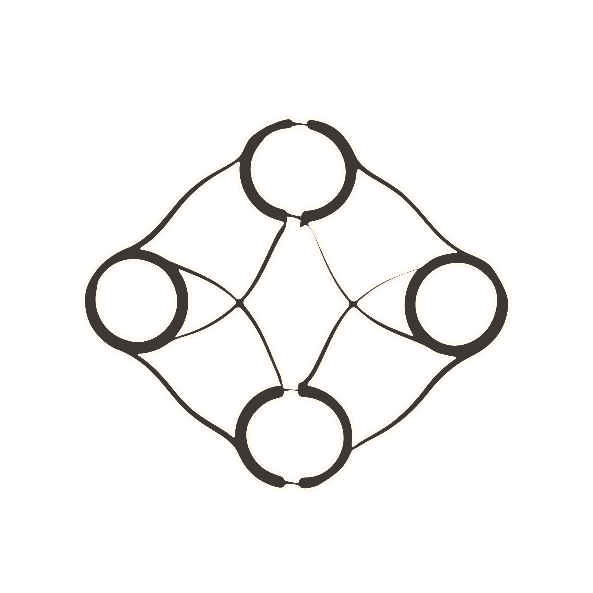

<div align="center">

</div>

<h1 align="center">
CAM
</h1>

<div align="center">

    

</div>

<h3 align="center">
Continuous Architectural Memory
</h3>

<div align="center">
    


</div>

<p align="center">A semantic memory system designed for Claude Code. Providing a interface layer for cross-session context through embeddings, annotations, summarized session notes and relational knowledge graphs – automatically & persistently triggered with Claude Hooks.
</p>

### Overview

CAM gives specifically Claude, persistent memory across sessions by:

- **Embedding Operations**: Vectorizing code changes, documentation, and conversations
- **Semantic Search**: Query past context by intent, not just keywords
- **Knowledge Graphs**: Building relationships between concepts over time
- **Automatic Hooks**: Claude Code integration for hands-free memory updates

### v2.0 Features

| Category | Features |
|----------|----------|
| **Intelligence Layer** | Importance tiers (critical/high/normal/reference), Decision store, Invariant management, Causal tracking |
| **Query DSL** | TOML queries, Graph expansion, Multi-hop reasoning |
| **Memory Management** | Inflection detection, Smart compression, Reconstruction context, Adaptive retrieval |
| **PR Workflow** | Session PRs instead of auto-commits, Conventional Commits |

See [CHANGELOG.md](CHANGELOG.md) for full details and [COMMANDS.md](COMMANDS.md) for CLI reference.

### Two Sources of Truth

1. **Hub** (`.ai/` directory): Structured documentation for your project | <strong>.ai/ documentation system inspired by [Coolify](https://github.com/coollabsio/coolify).</strong>

2. **CAM** (Semantic database): Cross-session memory with embeddings and graphs

> [!NOTE]
> Silly little blurb, but implementing CAM into your workflow is a bit bleh, kinda nuisance-ish(?) but hey it's open source, a MVP, and maybe the right direction in terms of persistent memory?? So - iterate, contribute, use, abuse, or don't! 

### <ins>Setup</ins>

```bash
# Clone the repository
git clone https://github.com/blas0/Severance.git
cd severance
```

```bash
# Backup your global .claude folder, `~/.claude`.
mkdir .oldclaude && cp -r .claude .oldclaude
```
```bash
# Run setup script, this WILL overwrite your ~/.claude folder.
./setup.sh
```

>The setup script will:
>- Check prerequisites (Python 3.9+, jq, sqlite3)
>- Deploy CAM template to `~/.claude/cam-template/`
>- Install hooks to `~/.claude/hooks/`
>- Configure `~/.claude/settings.json` with correct paths
>- Prompt for your Gemini API key (required for embeddings)

Append your `.oldclaude` files proactively back into the newly scaffolded `~/.claude` folder.
> [!IMPORTANT]
> When appending to `CLAUDE.md`... avoid unnecessary context. CAM interface + .ai/ doc sys are in place for workflow sessions.

You are now ready to move on & implement it into any project!

### <ins>Project Installation</ins>

```bash
# Navigate to any project directory and backup the following: `.claude/` `GEMINI.md` `.cursor` `CLAUDE.md`
mkdir dotbackup && cp -r .claude .cursor GEMINI.md CLAUDE.md dotbackup
```
```bash
# Init CAM, copies ~/.claude/cam-template + scaffolds into project accordingly
~/.claude/hooks/init-cam.sh
```

> This will:
> - Initialize CAM interface in `.claude/cam/`
> - Scaffold `.ai/` documentation structure
> - Generate agent entry points (CLAUDE.md, GEMINI.md, cursor-rules.mdc)
> - Show bootstrap prompts for your AI agent

Append your `dotbackup` files proactively into the newly scaffolded `CLAUDE.md` `GEMINI.md` `.cursor/` `.claude`

After prompting Claude with the bootstrap prompts returned to you post `init-cam`, you are good to go. Start a new session (recommended to use `--verbose`) & fire away, `use cam to return to me the following: what is my projects purpose, what codestack is my project made of, & explain to me the frontend and backend routes/mappings and what each function/component serves as`. 

This should return the proper information via CAM (you'll know from verbosity response) & from there you can feel confident in moving towards the fun stages of development via debugging/researching/implementing/etc.

### <ins>Usage</ins>

#### For Claude Code

Claude Code has automatic hook integration. CAM queries and updates happen automatically via:
- **SessionStart**: Validates CAM state, writes session state for cross-hook communication
- **UserPromptSubmit**: Queries CAM before processing your message, injects primers post-compact
- **PreToolUse**: Queries CAM before executing tools
- **PostToolUse**: Annotates operations + auto-ingests modified files
- **PreCompact**: Crystallizes session knowledge before `/compact`, caches primer for recovery
- **Stop**: Suggests `/compact` when context grows large (800+ lines)
- **SessionEnd**: Summarizes session, builds knowledge graph, cleans up session state

> When you Edit/Write a file, CAM automatically ingests the new content using change detection (only re-ingests if content hash changed).

### <ins>Commands & Extras</ins>

Since CAM utilizes Claude Code Hooks, any agent/API that can't be used in Claude Code will have to be manually steered. 

CAM invocation instructions are embedded in their entry point files (`GEMINI.md` and `cursor-rules.mdc`) during the `init-cam.sh` scaffolding.

For more information regarding how cam works you check out the [commands](COMMANDS.md) here.

You can also prompt Claude semantically to run these scripts, as it has the directive to do so via the `~/.claude/CLAUDE.md` `yourproject/CLAUDE.md` similar to the Gemini & Cursor agents.

---

### <ins>Iterations</ins>

When tailoring CAM for your own use case, edit files within:
`~/.claude/cam-template` 

```bash
# This syncs cam-template/settings-hooks.json into ~/.claude/settings.json
# This syncs cam-template/hooks/* into ~/.claude/hooks/
~/.claude/hooks/cam-sync-template.sh
```


### <ins>Upgrading</ins>

```bash
# From your project's `.claude/cam/` directory:
./cam.sh upgrade

# Force reinstall even if versions match:
./cam.sh upgrade --force

# You may get hook errors during upgrading, after upgrade, re-run ./cam.sh upgrade --force.
# This happens due to active 'depracated' hooks being overwritten with the revised hooks, sometimes causing conflicts.
# Ensure any changes you make to CAM is in ~/.claude/cam-template
```

This will update the projects (.claude/cam) CAM interface accordingly: `cam_core.py` `cam.sh`

### <ins>Auto-Migration (v2.0+)</ins>

Existing CAM databases automatically upgrade on first v2.0 run:
- Adds `importance_tier` column to embeddings table
- Creates `decisions` and `invariants` tables
- Existing data preserved with default values
- No manual migration required

### <ins>Project Structure</ins>

After initialization, your project will have:

```
your-project/
├── CLAUDE.md              # Claude Code entry point
├── GEMINI.md              # Gemini entry point
├── .cursor/
│   └── rules/
│       └── cursor-rules.mdc  # Cursor entry point
├── .ai/                   # Documentation hub
│   ├── README.md
│   ├── core/
│   ├── development/
│   ├── patterns/
│   └── meta/
└── .claude/
    └── cam/               # CAM interface
        ├── cam.sh
        ├── cam_core.py
        ├── vectors.db
        ├── metadata.db
        ├── graph.db
        └── venv/
```

---

### <ins>Ralph Wiggum Integration</ins>

CAM v1.6.0 adds support for the [Ralph Wiggum](https://ghuntley.com/ralph/) iterative development technique with persistent memory across loops.

#### What This Enables

- **Loop Start**: Query CAM for patterns from similar past tasks
- **Each Iteration**: Store iteration summary for analytics
- **Loop End**: Store comprehensive outcome for future reference
- **Cross-Loop Learning**: Future loops benefit from past successes

#### Ralph Plugin Modifications

To enable CAM integration in the Ralph Wiggum plugin, apply these changes to the plugin files:

**File 1: `ralph-wiggum/scripts/setup-ralph-loop.sh`**

```bash
# Append AFTER Line 8 (after "set -euo pipefail")
# === CAM INTEGRATION START ===
LOOP_ID=$(uuidgen 2>/dev/null || date +%s%N | sha256sum | cut -c1-16 2>/dev/null || date +%s)
CAM_CONTEXT=""
CAM_ENABLED="false"

if [ -f "./.claude/cam/cam.sh" ]; then
  CAM_ENABLED="true"
  SIMILAR_LOOPS=$(./.claude/cam/cam.sh ralph-patterns "$PROMPT" 2>/dev/null || echo "")
  if [ -n "$SIMILAR_LOOPS" ] && [ "$SIMILAR_LOOPS" != "No relevant Ralph patterns found." ]; then
    CAM_CONTEXT="\n---\n## Prior Experience (from CAM)\n$SIMILAR_LOOPS\n"
  fi
  echo "[#] CAM: Queried for relevant patterns"
fi
# === CAM INTEGRATION END ===

# Then modify Line ~140 (state file creation) to include new fields:
# Add these lines to the YAML frontmatter:
#   loop_id: "$LOOP_ID"
#   cam_enabled: $CAM_ENABLED
#   project: "$(basename $(pwd))"
# And append $CAM_CONTEXT after $PROMPT
```

**File 2: `ralph-wiggum/hooks/stop-hook.sh`**

```bash
# Append AFTER Line 25 (after COMPLETION_PROMISE extraction)
# === CAM INTEGRATION: Extract fields ===
LOOP_ID=$(echo "$FRONTMATTER" | grep '^loop_id:' | sed 's/loop_id: *//' | sed 's/^"\(.*\)"$/\1/')
PROJECT=$(echo "$FRONTMATTER" | grep '^project:' | sed 's/project: *//' | sed 's/^"\(.*\)"$/\1/')
CAM_ENABLED=$(echo "$FRONTMATTER" | grep '^cam_enabled:' | sed 's/cam_enabled: *//')
STARTED_AT=$(echo "$FRONTMATTER" | grep '^started_at:' | sed 's/started_at: *//' | sed 's/^"\(.*\)"$/\1/')
LOOP_ID="${LOOP_ID:-unknown}"
PROJECT="${PROJECT:-$(basename $(pwd))}"
CAM_ENABLED="${CAM_ENABLED:-false}"

# === CAM INTEGRATION: Storage function ===
store_loop_to_cam() {
  local outcome=$1
  if [ "$CAM_ENABLED" = "true" ] && [ -f "./.claude/cam/cam.sh" ]; then
    ./.claude/cam/cam.sh store-ralph-loop \
      "{\"loop_id\":\"$LOOP_ID\",\"iterations\":$ITERATION,\"outcome\":\"$outcome\",\"project\":\"$PROJECT\",\"prompt\":\"...\",\"started_at\":\"$STARTED_AT\"}" \
      2>/dev/null &
    echo "[#] CAM: Stored loop summary"
  fi
}

# Call before "rm $RALPH_STATE_FILE" in max iterations block (~Line 51):
store_loop_to_cam "max_iterations"

# Call before "rm $RALPH_STATE_FILE" in completion promise block (~Line 125):
store_loop_to_cam "success"
```

**File 3: `ralph-wiggum/commands/cancel-ralph.md` (Optional)**

```bash
# Before removing state file, store cancellation to CAM:
if [ -f "./.claude/cam/cam.sh" ]; then
  LOOP_ID=$(grep '^loop_id:' .claude/ralph-loop.local.md | sed 's/loop_id: *//')
  ITERATION=$(grep '^iteration:' .claude/ralph-loop.local.md | sed 's/iteration: *//')
  ./.claude/cam/cam.sh store-ralph-loop \
    "{\"loop_id\":\"$LOOP_ID\",\"iterations\":$ITERATION,\"outcome\":\"cancelled\",\"project\":\"$(basename $(pwd))\",\"prompt\":\"cancelled\",\"started_at\":\"unknown\"}" \
    2>/dev/null || true
fi
rm .claude/ralph-loop.local.md
```

#### Architecture Notes

- **CAM is independent**: Works fully without Ralph plugin installed
- **Combined**: Ralph queries CAM at start, stores to CAM at end
- **No special access**: Ralph uses same CAM interface as any Claude session

### <ins>Graphs and Relationships</ins>

CAM automatically builds a knowledge graph with relationships between embeddings triggered by Claude Hooks.

#### Relationship Types

| Type | Source | Description |
|------|--------|-------------|
| `temporal` | Auto-discovered | Time-based sequence patterns between operations |
| `semantic` | Auto-discovered | Content similarity > 0.65 threshold |
| `causal` | Auto-discovered | Combined temporal + semantic inference |
| `modifies` | PostToolUse hook | Created when editing `.ai/` documents |
| `references` | Ingest-time | Detected from markdown `[text](path.md)` links |

#### Automatic Relationship Creation

- **SessionEnd**: Runs `graph build` automatically at session close
- **PostToolUse**: Creates "modifies" relationships when editing `.ai/` files
- **Ingest**: Parses markdown for cross-references and creates "references" relationships

---

.ai/ documentation system inspired by  [Coolify](https://github.com/coollabsio/coolify).
